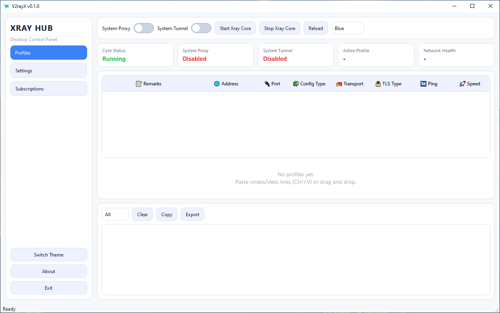
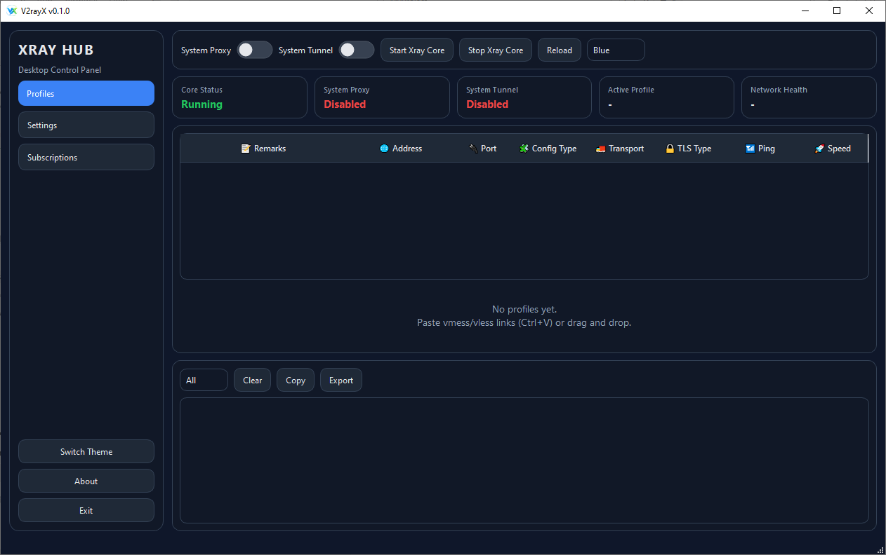

# V2rayX

## ?????

`V2rayX` ?? ?????? ?????? ?????? ???? ?????? ? ????? Xray ???. ??? ?????? ?????? ???????? ??????????? ??? `Ping/Speed`? ?????? ????? ? Tunnel Mode ?? ?? ?? ???? ???? ????? ??????.

### ??????? ????
- ?????? ?????????? (`vmess`, `vless`, `trojan`, `ss`, `hy2`, `tuic`, `socks`, `wireguard`, ...)
- ?????? ? ????????? Subscription
- ??? `Ping` ? `Speed` ???? ?? ???????
- ?????/??? System Proxy
- ???????? ?? Tunnel Mode (??????? ?????? ?????)
- ??? ????? ???? ????????

### ??????????
- Windows 10/11 (???? 64 ???)
- `curl` ???? ??? `Ping/Speed` (??????? ??? Windows 10/11 ??????? ??????? ????? ???)
- ?????? Administrator ??? ???? Tunnel Mode
- **????? ?? ??? .NET Framework ??????? ????** (?? ???? ????? exe)

### ???????? ????? ?? ???? ???????
- `xraycore/xray.exe`
- `xraycore/wintun.dll`
- `xraycore/geoip.dat`
- `xraycore/geosite.dat`

### ????? ???? ?????

---

## English
`V2rayX` is a Windows desktop client for managing and running Xray.
It provides profile management, subscription updates, `Ping/Speed` tests, system proxy control, and tunnel mode in a single UI.

### Key Features
- Profile management (`vmess`, `vless`, `trojan`, `ss`, `hy2`, `tuic`, `socks`, `wireguard`, ...)
- Subscription fetch and update
- Per-profile `Ping` and `Speed` tests
- Set/Clear System Proxy
- Tunnel mode support (requires Administrator privileges)
- Built-in logs for troubleshooting

### Requirements
- Windows 10/11 (64-bit)
- `curl` for `Ping/Speed` tests (usually available by default on modern Windows)
- Administrator privileges only for Tunnel Mode
- **No separate .NET Framework installation is required** (for packaged exe build)

### Included in Download Package
- `xraycore/xray.exe`
- `xraycore/wintun.dll`
- `xraycore/geoip.dat`
- `xraycore/geosite.dat`

### English Screenshot

---

## License
MIT
